# My MICON

[Next-MICON micon-generator](https://github.com/Next-MICON/micon-generator) を使用した 32bit RISC-V マイコン。

32bit RISC-V Microcontroller based on [Next-MICON micon-generator](https://github.com/Next-MICON/micon-generator).

## Tutorial

### 1. Get FPGA board

[TinyFPGA BX](https://www.crowdsupply.com/tinyfpga/tinyfpga-ax-bx)

### 2. Install tools

Ubuntu 22.04

```
$ sudo apt update
$ sudo apt install -y yosys nextpnr iverilog gtkwave
```

install micon-generator

[Next-MICON/micon-generator](https://github.com/Next-MICON/micon-generator)

### 3. Build and run

```
$ git clone git@github.com:kanade-k-1228/mysoc.git
$ cd mysoc/src
$ mkdir .build
$ make
```

## Datasheet




### GPIO


```c++:
enum GPIO::MODE{ IN=0, OUT=1 };
void GPIO::mode(MODE);
void GPIO::write(int);
uint32_t GPIO::read();
```

### PWM


### UART


### MUX

### Timer

### Watchdog

### Mixier

**TODO**

- Mixier
- Sawtooth
- Triangle
- Envelope

## Memory Mapped Peripheral Interface


valid 信号を High にすると、モジュールが有効になります。

wstrb 信号が High になると、DFF に書き込まれます。
上の図では、wstrb が DFF のクロックに直接入力されていますが、実際にはマスタークロックに同期的に書き込まれます。
つまり、wstrb が High のサイクルで書き込まれます。

```verilog:
always @(posedge clk) begin
    if(wstrb) registor <= wdata;
end
```

モジュールの出力信号が整ったら、rdata 信号を High にします。


## Synthesizer


## PicoRV32 の割り込み

[Custom Instructions for IRQ Handling | PicoRV32](https://github.com/YosysHQ/picorv32/tree/master#custom-instructions-for-irq-handling).

PicoRV32 の割り込み実装は、RISC-V の標準とは異なります。

PicoRV32 に割り込み機能を追加するには、Verilog 上で `module picorv32` のパラメタ `.ENABLE_IRQ` を `1` にセットします。

PicoRV32 コアには、32 個の割り込みがあります。
picorv32 の irq 入力の対応するビットをアサートすることで、割り込みをトリガーできます。

割り込みハンドラが開始されると、EOI (End of Interrupt) 信号が High になります。
割り込みハンドラがリターンされると、EOI 信号は Low に戻ります。

### 割り込み番号

IRQ 0〜2 は、コア内部に組み込まれた回路によって、トリガーされる可能性があります。

| IRQ | 割り込みソース                              |
| --- | ------------------------------------------- |
| 0   | ｄタイマー割り込み                          |
| 1   | EBREAK / ECALL または 不正な命令            |
| 2   | BUS エラー (メモリアクセスアライメント違反) |

これらの割り込みは、PCPI を介して接続されたコプロセッサなどのコア外の回路からもトリガーできます。

### q レジスタ

PicoRV32 コアには、割り込み処理に使用される q0 から q3 までの追加の 32 ビットレジスタがあります。

| name | function               |
| ---- | ---------------------- |
| q0   | 戻りアドレス           |
| q1   | 割り込みのビットマスク |
| q2   | 割り込み汎用レジスタ   |
| q3   | 割り込み汎用レジスタ   |

割り込み信号がアサートされると、レジスタ q0 には戻りアドレスが、q1 には割り込みのビットマスクがセットされます。
q1 に複数のビットが設定されている場合、割り込みハンドラ１回の呼び出しで複数の IRQ を処理する必要があります。

圧縮命令のサポートが有効になっている場合、q0 の LSB は中断された命令が圧縮命令である場合に設定されます。
これは、IRQ ハンドラが中断された命令をデコードする場合に使用できます。

レジスタ q2 および q3 は初期化されておらず、IRQ ハンドラ内でレジスタ値を保存/復元する際の一時的なストレージとして使用できます。

### 割り込み命令

以下のすべての命令は、custom0 オペコードの下でエンコードされます。
これらの命令では、f3 フィールドと rs2 フィールドは無視されます。

割り込み命令に対するニーモニックを実装する GNU アセンブラマクロについては、`firmware/custom_ops.S` を参照してください。
割り込みハンドラのアセンブララッパーの実装例については、`firmware/start.S` を参照してください。
また、実際の割り込みハンドラについては、`firmware/irq.c` を参照してください。

|                  | f7      | rs2   | qs/rs      | f3  | rd/qd      | opecode | func               |
| ---------------- | ------- | ----- | ---------- | --- | ---------- | ------- | ------------------ |
| `getq rd, qs`    | 0000000 | ----- | 000XX (qs) | --- | XXXXX (rd) | 0001011 | rd <= qs           |
| `setq qd, rs`    | 0000001 | ----- | XXXXX (rs) | --- | 000XX (qd) | 0001011 | qd <= rs           |
| `retirq`         | 0000010 | ----- | 00000 (rs) | --- | 00000 (rd) | 0001011 | pc <= q0, eoi <= 0 |
| `maskirq rd, rs` | 0000011 | ----- | XXXXX (rs) | --- | XXXXX (rd) | 0001011 | rd <= imask <= rs  |
| `waitirq rd`     | 0000100 | ----- | 00000      | --- | XXXXX (rd) | 0001011 |                    |
| `timer rd, rs`   | 0000101 | ----- | XXXXX (rs) | --- | XXXXX (rd) | 0001011 | rd <= timer <= rs  |

#### `getq`

q レジスタから汎用レジスタに値をコピーします。

#### `setq`

汎用レジスタから q レジスタに値をコピーします。

#### `retirq`

割り込みから復帰します。
この命令は、`q0`の値をプログラムカウンタにコピーし、割り込みを再度有効化します。

#### `maskirq`

CPU 内部にある `irq_mask` レジスタは、無効化された割り込みのビットマスクです。
`maskirq` 命令は、元の `irq_mask` を `rd` に書き込み、`rd` を `irq_mask` レジスタに書き込みます。

プロセッサは、すべての割り込みが無効の状態で起動するため、割り込みを使用するには `maskirq` 命令で割り込みを有効にしてください。

二重割り込みはできません。割り込み処理中は割り込みを受け付けません。

割り込み１番（不正な命令）および２番（バスエラー）の割り込みが禁止状態で、該当の割り込みが発生した場合、プロセッサは停止します。

#### `waitirq`

割り込みが発生するまで実行を一時停止します。
ペンディング IRQ のビットマスクが `rd` に書き込まれます。

#### `timer`

CPU の内部にはタイマが入っています。
タイマーカウンタを新しい値にリセットします。
カウンタはクロックサイクルをカウントダウンし、0 から 1 に遷移するとタイマー割り込みをトリガーします。
カウンタをゼロに設定するとタイマーが無効になります。カウンタの古い値が rd に書き込まれます。

## 環境構築

### TinyFPGA

**必要なソフトウェア**

- [icestorm](https://github.com/YosysHQ/icestorm)
- [nextpnr](https://github.com/YosysHQ/nextpnr)
- [yosys](https://github.com/YosysHQ/yosys)
- [riscv-gnu-toolchain](https://github.com/riscv/riscv-gnu-toolchain)
